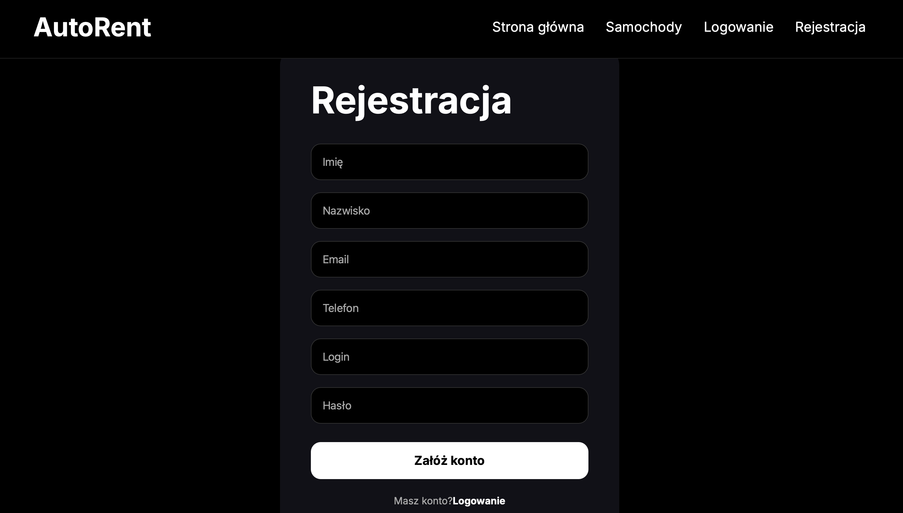
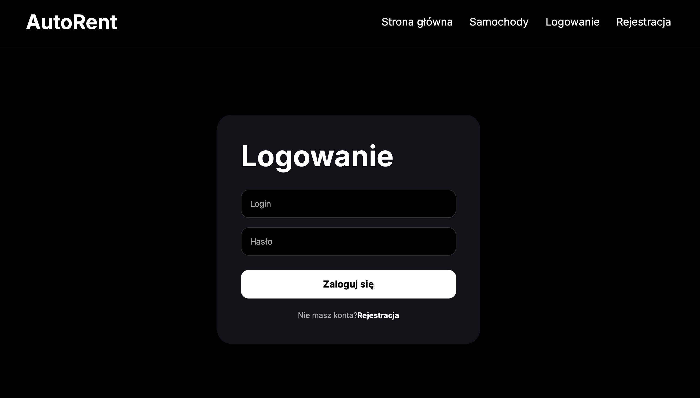
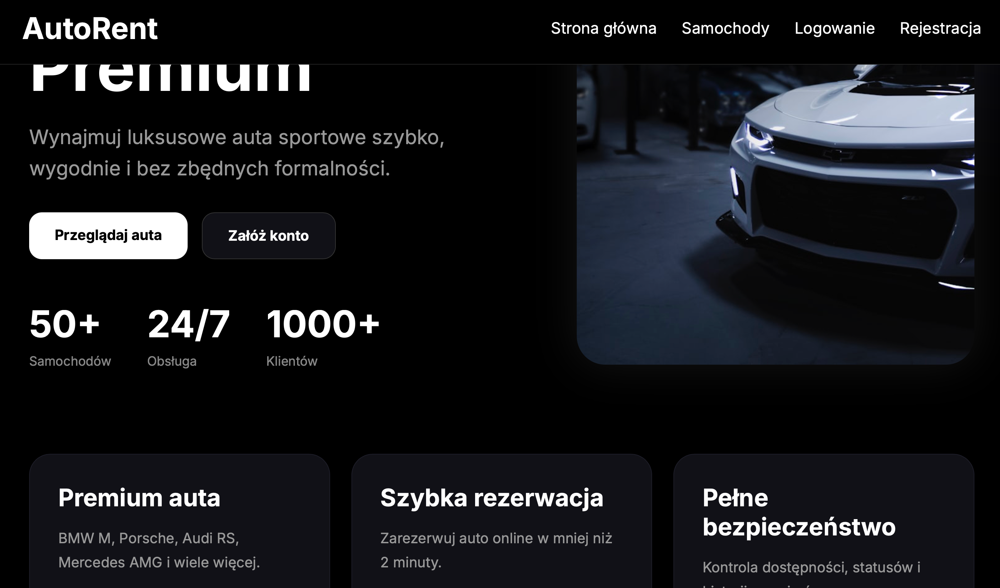
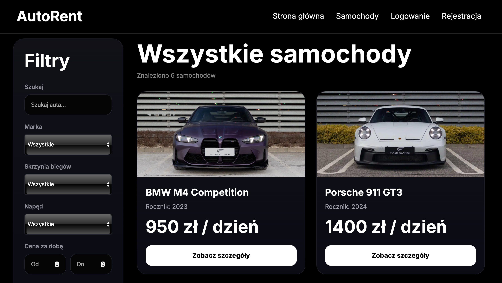
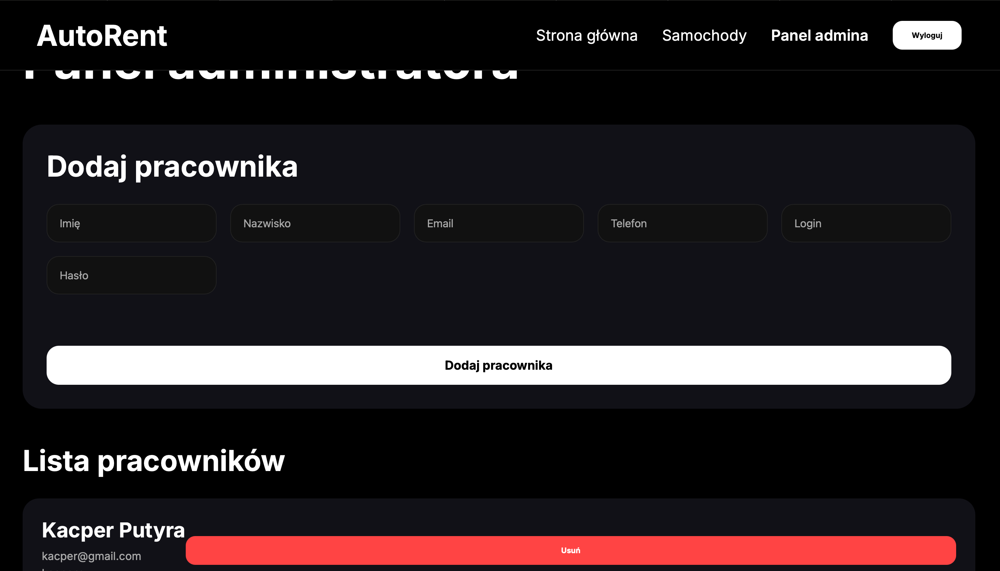
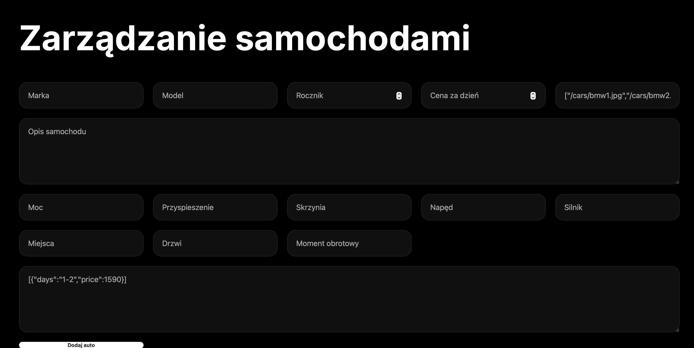

# Car Rental Project

Fullstack car rental management system created with React, PHP and MySQL.

---

# Features

## User
- Registration and login
- Browse available cars
- Create reservations
- View reservation history

## Employee
- Manage reservations
- Finish reservations

## Admin
- Add cars
- Edit cars
- Delete cars
- Manage workers
- Manage users

---

# Tech Stack

## Frontend
- React
- Vite
- React Router
- Axios
- CSS

## Backend
- PHP
- MySQL
- REST API

## Tools
- Git
- GitHub
- XAMPP

---

# Project Structure

```txt
car-rental-project/
 ├── car-rental/        # React frontend
 └── car-rental-api/    # PHP API
```
# Installation

## 1. Clone repository

```bash
git clone https://github.com/SzymekK-lab/car-rental-project.git
```

---

# Frontend Setup

## Go to frontend folder

```bash
cd car-rental
```

## Install dependencies

```bash
npm install
```

## Run frontend

```bash
npm run dev
```

---

## Frontend runs on:

```txt
http://localhost:5173
```

---

# Backend Setup

## Move API folder to XAMPP

Place:

```txt
car-rental-api
```

inside:

```txt
xampp/htdocs/
```

---

## Start services

Start:
- Apache
- MySQL

using XAMPP Control Panel.

---

# Database Setup

## Create database

Create MySQL database:

```txt
car_rental
```

---

## Configure database connection

Edit:

```txt
car-rental-api/config.php
```

and set your database credentials.

Example:

```php
$host = "localhost";
$user = "root";
$password = "";
$database = "car_rental";
```

---

# API URL

Default backend URL:

```txt
http://localhost/car-rental-api
```


---

# Screenshots

## Registration Page



## Login Page



---

## Dashboard





---

## Admin Panel




---

# Future Improvements

- JWT Authentication
- Docker support
- Role middleware
- Better UI/UX
- Environment variables
- REST API refactor
- Deployment

---

# Author

Szymon Kaletka